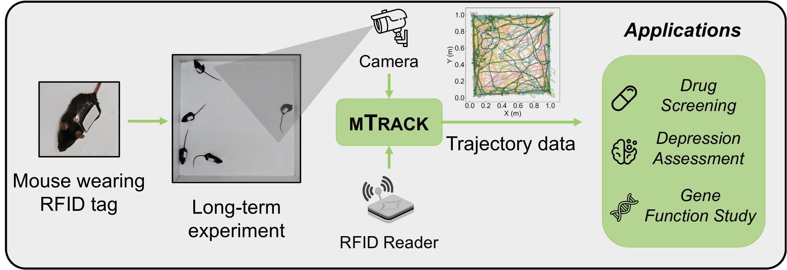
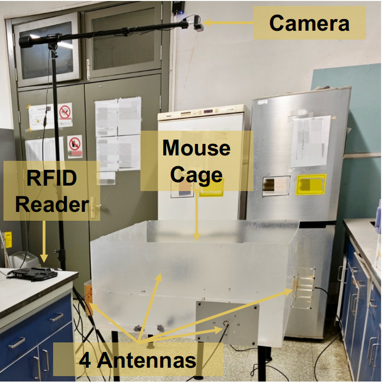
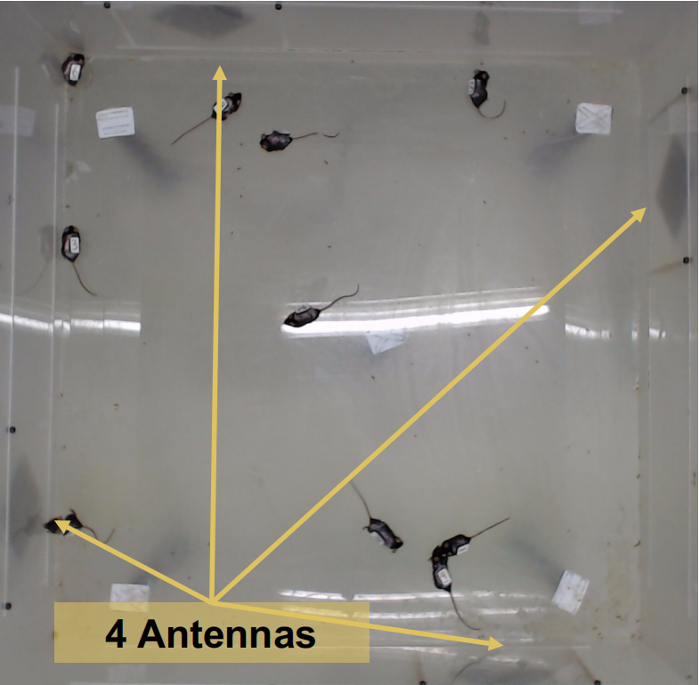
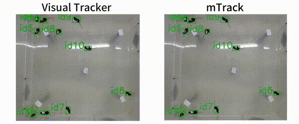
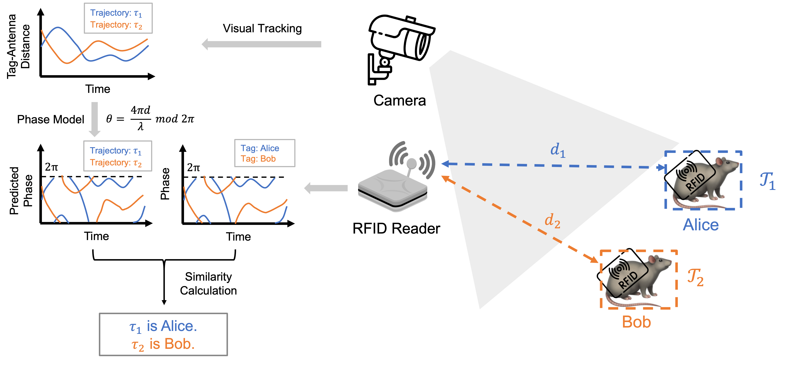
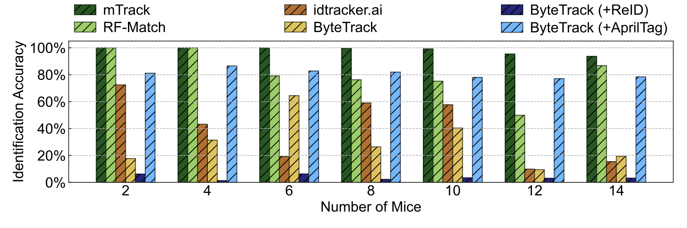
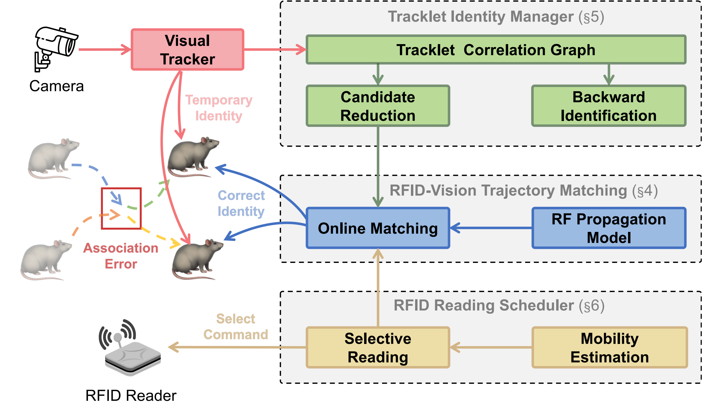

<div align="center">
  
</div>
<div align="center">
  
  
  
</div>

This is the official implementation of [\[SenSys'26\] mTrack: Enabling Long-term Mouse Social Behavior Analysis through RFID-Vision Hybrid Tracking](https://sensys.acm.org/2026/).

# Overview

mTrack is a hybrid RFID-vision tracking system designed for long-term, high-accuracy mouse tracking in social behavior studies. It addresses the critical limitations of existing visual tracking methods, which struggle to maintain consistent identity assignment when tracking multiple mice due to their nearly identical appearances and complex, erratic motion patterns.

<div align="center">
  
</div>

mTrack integrates **Ultra-High-Frequency (UHF) RFID technology** with **computer vision tracking** to enable accurate, self-correcting identification of individual mice over extended periods. By attaching UHF RFID tags to mice, the system provides robust identity information that complements visual tracking, achieving **99.23% identification accuracy** for up to **10 mice simultaneously** over multi-hour experiments.

<div align="center">
  
</div>

# Prerequisites

Install the dependencies:

```bash
conda create -n mtrack python=3.10
conda activate mtrack
pip install -r requirements.txt
```

# Usage

While the deployment of mTrack requires the setup of RFID reader and camera, you can run the codes without the RFID reader and camera with our collected data (download the data from [google drive](https://drive.google.com/drive/folders/1xnAaqWeOgh34i8lfG0K-ruVYgzFaxtFV?usp=sharing)).

**Step 1**: Download the data from [google drive](https://drive.google.com/drive/folders/1xnAaqWeOgh34i8lfG0K-ruVYgzFaxtFV?usp=sharing). The data contains the RFID records, visual tracking results and ground truth trajectory of the behavior for 2-14 mice. You can also download the raw image data from [this link](https://pan.baidu.com/s/5oydeBHwwACnyXwscCIDi0w).

**Step 2**: Run the following command to run the mTrack on the data:
```bash
python scripts/run/run_offline.py -rf input/10/rfid_data.csv -cam input/10/camera_data.csv -g input/10/gt.txt -c input/10/config.json -o output/10
```
If you have downloaded the raw image data, you can run the following command to run the mTrack with visualization:
```bash
python scripts/run/run_offline.py -rf input/10/rfid_data.csv -cam input/10/camera_data.csv -g input/10/gt.txt -c input/10/config.json -o output/10 -v -i raw_data/10/imgs
```

In the output folder, you will see the following files related to the tracking results of mTrack.
- `cv_trace.csv`: The visual tracking results.
- `matched_id.csv`: The matching results. Each row represents that certain RFID tag is matched with a certain visual tracklet at a certain frame.
- `bc.csv`: The backward identification results. Each row represents that certain tracklet is backward identified with a certain RFID tag at a certain frame.
- `gc.csv`: The global checker results. Each row represents that certain RFID tag might wrongly matched at a certain frame.

**Step 3**: Run `generate_gt.py` to correct `cv_trace.csv` with the files `matched_id.csv`, `bc.csv` and `gc.csv`.
```bash
python scripts/run/generate_gt.py -c input/10/config.json -d output/10 -g output/10/gt.txt
```

**Step 4**: Run `gt_process.py` to process the ground truth trajectory (remove duplicate IDs, interpolate the trajectory and convert the format to the one expected by the evaluation script).
```bash
python scripts/run/gt_process.py -i output/10/gt.txt -o1 output/10/gt_mtrack.csv -o2 output/10/gt_mtrack.csv -s 5
```

**Step 5**: Run the evaluation by comparing the corrected visual tracking result with the ground truth trajectory.
```bash
python scripts/metric/evaluate_identification_accuracy.py -g gt/10/gt.csv -p output/10/gt_mtrack.csv -o output/10/evaluation.json --direct_map --first_success
```

# System Architecture

mTrack consists of three main components:
- **RFID-vision trajectory matching algorithm**: The core of mTrack. It matches the RFID tags with the visual tracking results. It is implemented in `mtrack/match.py`.
- **Tracklet identity manager**: It manages the possible identities of the tracklets with a tracklet correlation graph. It is implemented in `mtrack/trackletgraph.py`.
- **RFID reading scheduler**: It schedules the RFID reading based on the tag mobility and matching status. It is implemented in `mtrack/select.py`.

<div align="center">
  
</div>

# Citation

If you find our work useful in your research, please consider citing our paper:

```bibtex
@inproceedings{liu2026mtrack,
  title={mTrack: Enabling Long-term Mouse Social Behavior Analysis through RFID-Vision Hybrid Tracking},
  author={Xingyuming Liu, Bo Liang, Haobo Wang, Zhonghao Li, Qirui Liu, Yanxue Xue, Yunhuai Liu, Chenren Xu},
  booktitle={ACM SenSys},
  year={2026}
}
```  